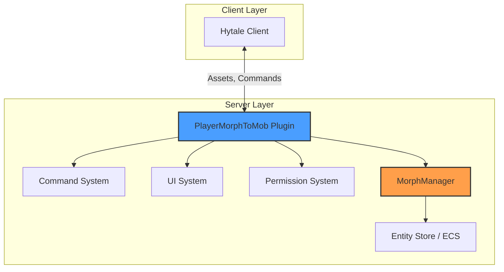
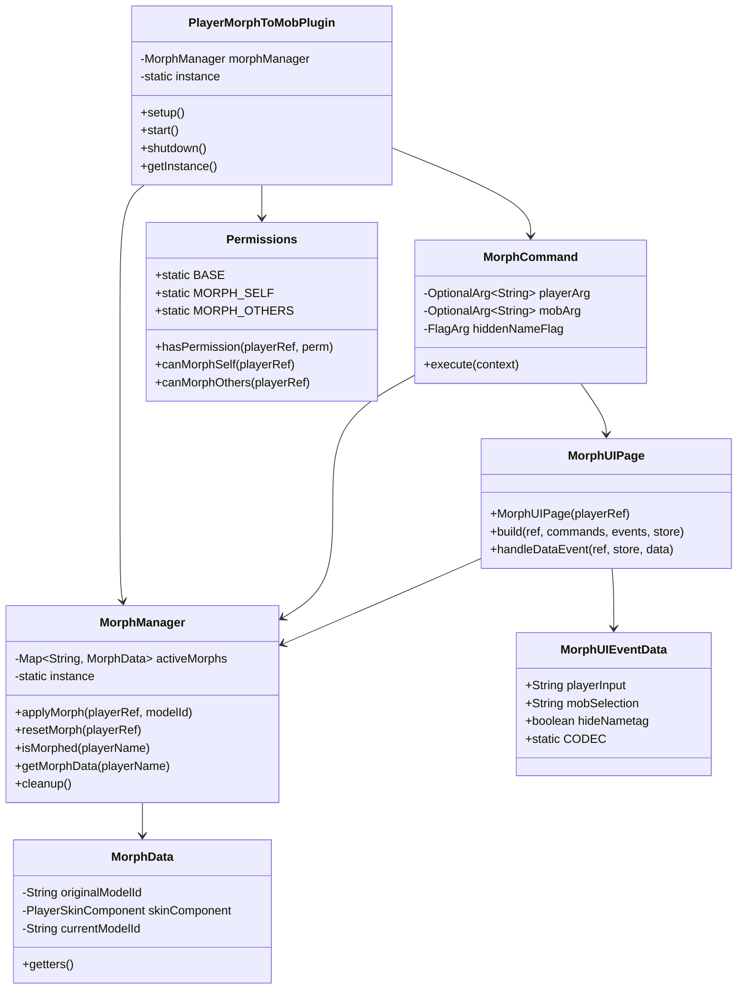
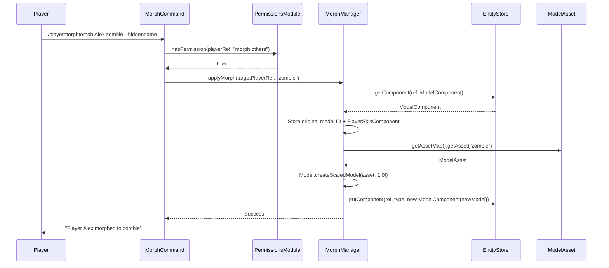
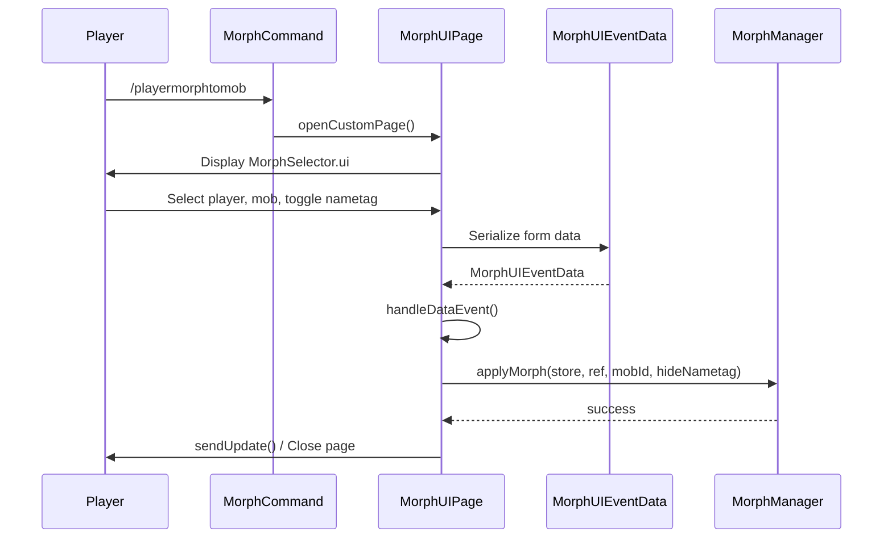
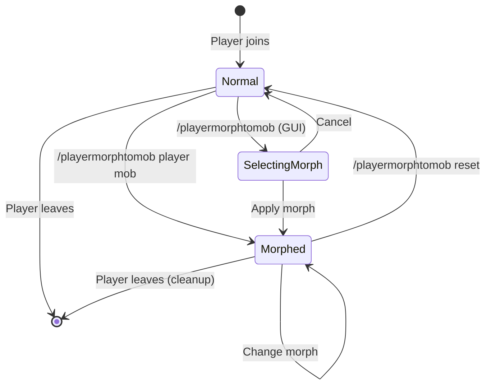
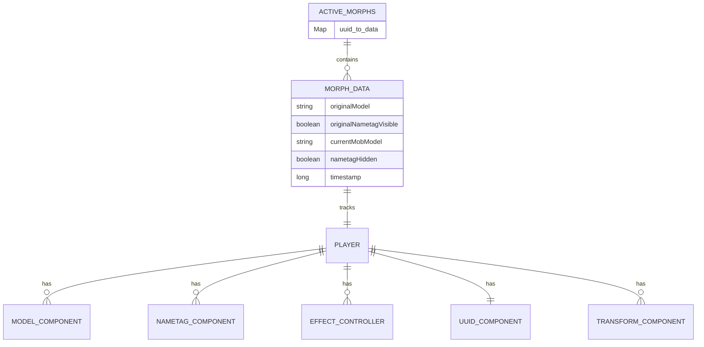
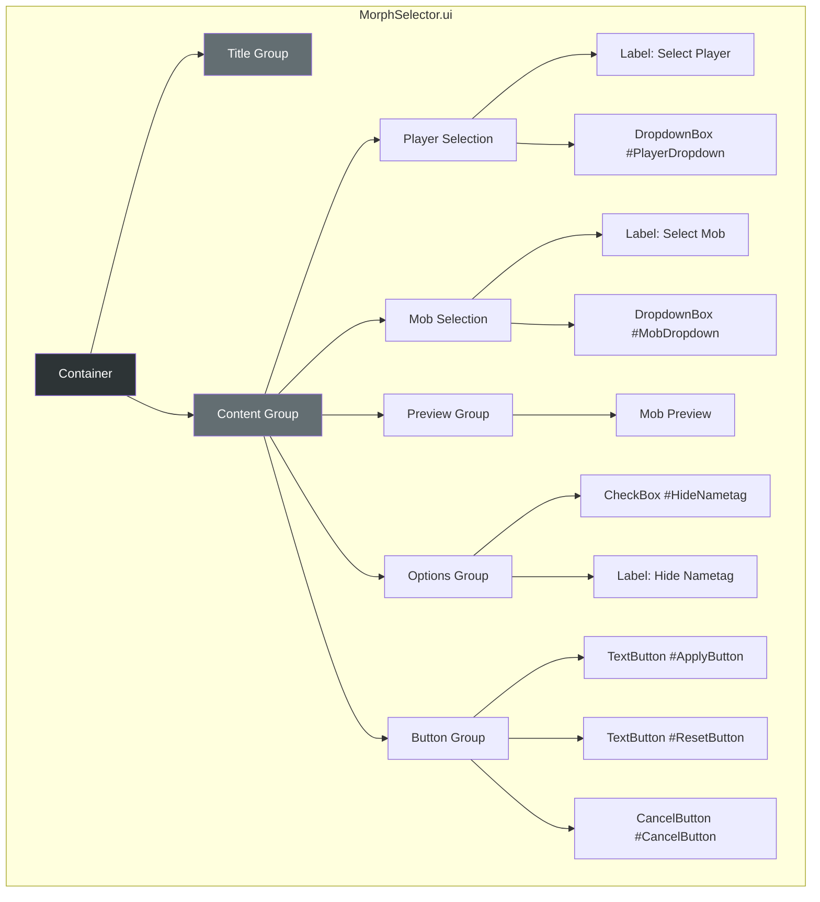
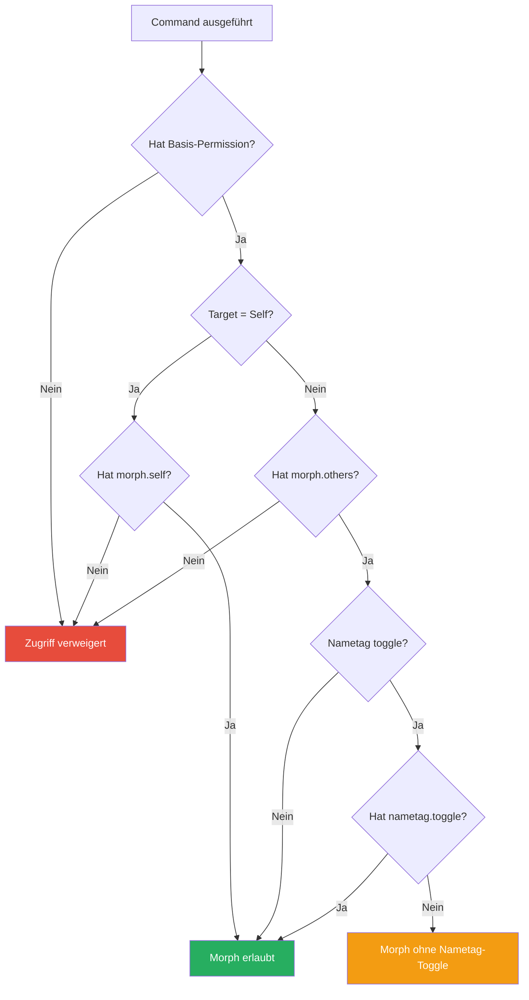
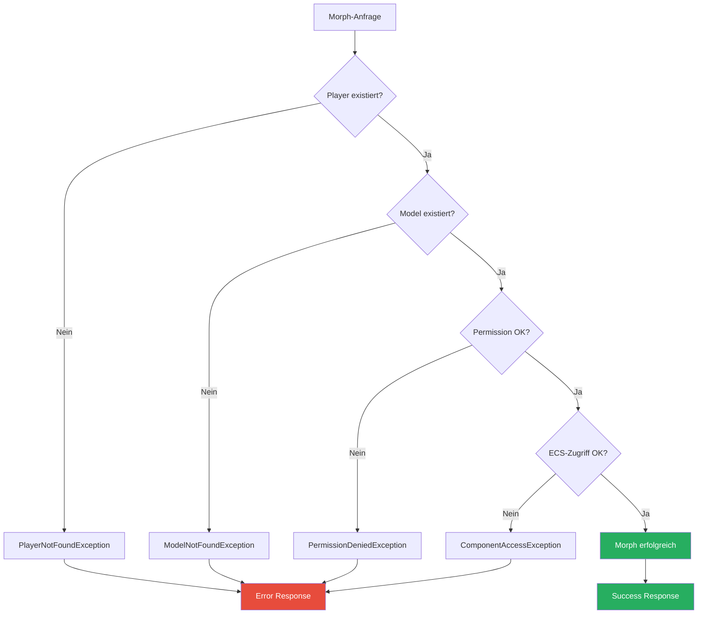

# PlayerMorphToMob - Architektur & Design

## System-Übersicht



## Komponenten-Architektur



## Datenfluss

### Command-Ausführung (ohne GUI)



**Hinweis:** Model-Änderung erfolgt über `putComponent()` mit neuem `ModelComponent`, NICHT über `setModelAssetPath()`!

### GUI-basierte Ausführung



## State Management



## Datei-Struktur

```
Gorduan-PlayerMorphToMob-1.0.0/
├── .claude/
│   └── docs/
│       ├── plugin-api.md
│       ├── commands.md
│       ├── ui-system.md
│       ├── permissions.md
│       ├── entity-morphing.md
│       └── architecture.md
│
├── src/
│   └── com/
│       └── gorduan/
│           └── hytale/
│               └── playermorphtomob/
│                   ├── PlayerMorphToMobPlugin.java
│                   ├── MorphManager.java
│                   ├── Permissions.java
│                   │
│                   ├── commands/
│                   │   └── MorphCommand.java
│                   │
│                   ├── ui/
│                   │   ├── MorphUIPage.java
│                   │   └── MorphUIEventData.java
│                   │
│                   └── data/
│                       ├── MorphData.java
│                       └── MobRegistry.java
│
├── resources/
│   └── Common/
│       └── UI/
│           └── Custom/
│               └── Pages/
│                   └── MorphSelector.ui
│
├── META-INF/
│   └── MANIFEST.MF
│
├── manifest.json
└── .Claude.md
```

## Entity Component Beziehungen



## UI-Komponenten Hierarchie



## Permission Flow



## Mathematische Konzepte

### Morph-Persistenz Wahrscheinlichkeit

Die Wahrscheinlichkeit, dass ein Morph über Zeit $t$ bestehen bleibt:

$$P(persist) = e^{-\lambda t}$$

Wobei $\lambda$ die Rate von Disconnect-Events ist.

### Speicherbedarf pro Morph

$$M_{morph} = S_{originalModel} + S_{currentModel} + S_{metadata}$$

Geschätzter Speicher pro aktivem Morph:

$$M_{total} \approx 256 + 256 + 64 = 576 \text{ bytes}$$

Bei $n$ aktiven Morphs:

$$M_{gesamt} = n \times 576 \text{ bytes}$$

### UUID-Kollisionswahrscheinlichkeit

Bei UUIDv4 (122 random bits):

$$P(collision) = 1 - e^{-\frac{n^2}{2 \times 2^{122}}}$$

Praktisch vernachlässigbar selbst bei Milliarden Spielern.

## API-Schnittstellenübersicht

### Öffentliche API

```java
// MorphManager API
public interface IMorphManager {
    // Model-Änderung: Verwendet putComponent() mit neuem ModelComponent
    boolean applyMorph(PlayerRef playerRef, String modelId);
    boolean resetMorph(PlayerRef playerRef);
    boolean isMorphed(String playerName);
    MorphData getMorphData(String playerName);
    List<String> getAvailableMobs();
    Set<String> getGameModelAssets();
    boolean isValidModel(String modelId);
    void cleanup();
}

// Custom Events (optional implementierbar)
public class PlayerMorphEvent extends IBaseEvent<Void> {
    PlayerRef getPlayerRef();
    String getOldModelId();
    String getNewModelId();
}

public class PlayerUnmorphEvent extends IBaseEvent<Void> {
    PlayerRef getPlayerRef();
    String getMorphedModelId();
}
```

## Fehlerbehandlung



## Deployment-Diagramm

```mermaid
graph TB
    subgraph "Server"
        HytaleServer[Hytale Server JAR]
        PluginDir[/mods/ Directory]
        ConfigDir[/config/ Directory]

        subgraph "Plugin"
            JAR[PlayerMorphToMob.jar]
            Assets[UI Assets]
        end

        PluginDir --> JAR
        JAR --> Assets
    end

    subgraph "Clients"
        Client1[Player 1]
        Client2[Player 2]
        ClientN[Player N]
    end

    HytaleServer --> PluginDir
    HytaleServer --> ConfigDir
    Client1 <-->|Auto-Sync Assets| HytaleServer
    Client2 <-->|Auto-Sync Assets| HytaleServer
    ClientN <-->|Auto-Sync Assets| HytaleServer
```

## Technologie-Stack

| Komponente | Technologie |
|------------|-------------|
| Runtime | OpenJDK 25 |
| Server | Hytale Server API |
| Plugin-System | JavaPlugin (com.hypixel.hytale.server.core.plugin) |
| UI-Format | .ui (Hytale-spezifisch, NoesisGUI in Planung) |
| Daten-Serialisierung | BuilderCodec / JSON |
| Logging | HytaleLogger (java.util.logging) |
| Build | Gradle 9.2.0 |
| IDE | IntelliJ IDEA (empfohlen) |

## Quellen

- [Hytale Modding Strategy](https://hytale.com/news/2025/11/hytale-modding-strategy-and-status)
- [Hytale Server Docs](https://hytale-docs.pages.dev/)
- [Hytale Modding Dev](https://hytalemodding.dev/en/docs)
- [Britakee Documentation](https://britakee-studios.gitbook.io/hytale-modding-documentation)
