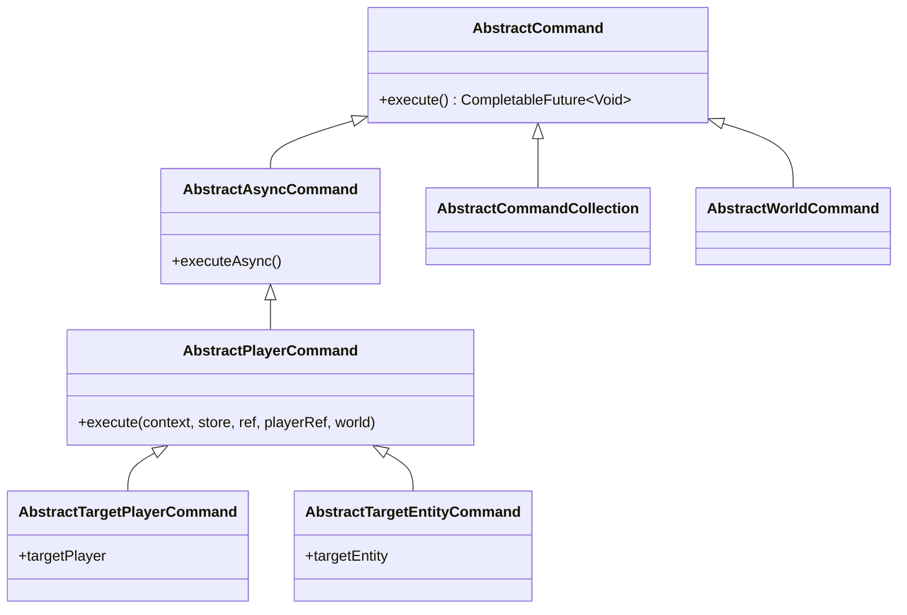

# Hytale Command System

## Übersicht

Das Hytale Command System ermöglicht die Erstellung von Chat-Commands mit Argumenten, Permissions und asynchroner Ausführung.

## Command-Typen



### AbstractCommand
Basis für alle Commands. Implementiert `execute()` mit Rückgabe `CompletableFuture<Void>`.

### AbstractAsyncCommand
Handhabt asynchrone Operationen über `executeAsync()`.

### AbstractPlayerCommand
**Für PlayerMorphToMob relevant!** Beschränkt Ausführung auf Spieler.

### AbstractTargetPlayerCommand
Für Commands die andere Spieler targeten.

### AbstractCommandCollection
Gruppiert verwandte Subcommands zusammen.

## Command erstellen

### Basis-Struktur

```java
package com.gorduan.hytale.playermorphtomob.commands;

import com.hypixel.hytale.server.core.command.system.AbstractCommand;
import com.hypixel.hytale.server.core.command.system.CommandContext;
import com.hypixel.hytale.server.core.command.system.arguments.system.OptionalArg;
import com.hypixel.hytale.server.core.command.system.arguments.system.FlagArg;
import com.hypixel.hytale.server.core.command.system.arguments.types.ArgTypes;
import com.hypixel.hytale.server.core.entity.entities.Player;
import com.hypixel.hytale.server.core.universe.PlayerRef;
import com.hypixel.hytale.server.core.Message;

import javax.annotation.Nonnull;
import javax.annotation.Nullable;
import java.util.concurrent.CompletableFuture;

public class MorphCommand extends AbstractCommand {

    // Argumente definieren
    private final OptionalArg<String> playerArg;
    private final OptionalArg<String> mobArg;
    private final FlagArg hiddenNameFlag;
    private final FlagArg forceFlag;  // Überspringt Vorschau

    public MorphCommand() {
        // super(name, description)
        super("playermorphtomob", "Morph a player into a mob model");

        // Argumente registrieren
        playerArg = withOptionalArg("player", "Target player name", ArgTypes.STRING);
        mobArg = withOptionalArg("mob", "Mob ID to morph into", ArgTypes.STRING);
        hiddenNameFlag = withFlagArg("hiddenname", "Hide the player's nametag");
        forceFlag = withFlagArg("force", "Skip preview and apply morph directly");

        // Aliase hinzufügen
        addAliases("morph", "pmtm");
    }

    @Override
    @Nullable
    protected CompletableFuture<Void> execute(@Nonnull CommandContext context) {
        // Prüfen ob Sender ein Spieler ist
        if (!context.isPlayer()) {
            context.sender().sendMessage(Message.of("This command can only be used by players."));
            return CompletableFuture.completedFuture(null);
        }

        // Player aus Context abrufen
        Player player = context.senderAs(Player.class);
        PlayerRef playerRef = player.getPlayerRef();

        // Argumente abrufen via context.get()
        String targetPlayer = playerArg.provided(context) ? context.get(playerArg) : null;
        String mobId = mobArg.provided(context) ? context.get(mobArg) : null;
        boolean hideNametag = context.get(hiddenNameFlag);

        // Wenn keine Argumente -> Hilfe zeigen oder GUI öffnen
        if (targetPlayer == null && mobId == null) {
            showHelp(playerRef);
            return CompletableFuture.completedFuture(null);
        }

        // Command-Logik ausführen
        if (targetPlayer != null && mobId != null) {
            executeMorph(playerRef, targetPlayer, mobId, hideNametag);
        }

        return CompletableFuture.completedFuture(null);
    }

    private void showHelp(PlayerRef playerRef) {
        playerRef.sendMessage(Message.of("Usage: /morph <player> <mob> [--hiddenname]"));
    }

    private void executeMorph(PlayerRef sender, String playerName, String mobId, boolean hideNametag) {
        // Morph-Logik hier implementieren
    }
}
```

**Hinweis:** Es gibt auch `AbstractPlayerCommand`, das `AbstractCommand` erweitert und zusätzliche Parameter in der execute-Methode bereitstellt (`Store`, `Ref`, `PlayerRef`, `World`). Für einfache Commands reicht `AbstractCommand` jedoch aus.

## Argument-Typen

### ArgTypes (Built-in)

```java
ArgTypes.STRING      // String-Wert
ArgTypes.INTEGER     // Integer-Wert
ArgTypes.BOOLEAN     // Boolean-Wert
ArgTypes.FLOAT       // Float-Wert
ArgTypes.DOUBLE      // Double-Wert
ArgTypes.UUID        // UUID-Wert
```

### Argument-Kategorien

#### Required Arguments (Pflicht)

```java
RequiredArg<String> playerArg = withRequiredArg(
    "player",              // Name
    "Target player name",  // Beschreibung
    ArgTypes.STRING        // Typ
);
```

#### Optional Arguments

```java
// Syntax: --name value
OptionalArg<String> worldArg = withOptionalArg(
    "world",
    "Target world",
    ArgTypes.STRING
);
```

#### Default Arguments

```java
// Mit Standardwert
DefaultArg<Integer> radiusArg = withDefaultArg(
    "radius",
    "Spawn radius",
    IntArgumentType.ranged(1, 100),
    10,           // Default-Wert
    "10 blocks"   // Beschreibung des Defaults
);
```

#### Flag Arguments

```java
// Boolean-Switch ohne Wert
FlagArg verboseFlag = withFlagArg(
    "verbose",
    "Enable verbose output"
);
```

## Argument-Zugriff

```java
@Override
@Nullable
protected CompletableFuture<Void> execute(@Nonnull CommandContext context) {
    // Prüfen ob Argument angegeben wurde
    if (playerArg.provided(context)) {
        String player = context.get(playerArg);
        // Argument wurde angegeben
    }

    // Flag Args (boolean)
    boolean isVerbose = context.get(verboseFlag);

    // Alternative: Direkt mit null-Check
    String mobId = mobArg.provided(context) ? context.get(mobArg) : null;

    return CompletableFuture.completedFuture(null);
}
```

## Command-Registrierung

```java
// In Plugin setup()
@Override
public void setup() {
    // Einzelnen Command registrieren
    this.getCommandRegistry().registerCommand(new MorphCommand());

    // System-Level Command (nur für spezielle Fälle)
    // CommandManager.get().registerSystemCommand(new SystemCommand());
}
```

## Subcommands

```java
public class MorphCommandCollection extends AbstractCommandCollection {

    public MorphCommandCollection() {
        super("playermorphtomob", "Player morph commands");

        // Subcommands hinzufügen
        addSubCommand(new MorphSetCommand());     // /playermorphtomob set
        addSubCommand(new MorphResetCommand());   // /playermorphtomob reset
        addSubCommand(new MorphListCommand());    // /playermorphtomob list
    }
}
```

## Permission-Integration

### Automatische Permission

Commands generieren automatisch Permission-Nodes:
`{plugin.basepermission}.command.{commandname}`

Beispiel: `playermorphtomob.command.playermorphtomob`

### Manuelle Permission-Prüfung

```java
@Override
protected CompletableFuture<Void> execute(CommandContext context, ...) {
    // Sender abrufen
    if (!context.sender().hasPermission("playermorphtomob.morph.others")) {
        context.sender().sendMessage(Message.raw("No permission!"));
        return null;
    }

    // Command-Logik...
}
```

### Custom Permission Node

```java
@Override
protected String generatePermissionNode() {
    return "playermorphtomob.custom.permission";
}
```

### Permission-Check deaktivieren

```java
@Override
protected boolean canGeneratePermission() {
    return false; // Keine automatische Permission
}
```

## Nachrichten senden

```java
import com.hypixel.hytale.server.chat.Message;

// Einfache Nachricht
context.sender().sendMessage(Message.raw("Hello World!"));

// Formatierte Nachricht
context.sender().sendMessage(Message.of("Player {0} morphed to {1}", playerName, mobId));
```

## Asynchrone Ausführung

**Wichtig:** `AbstractPlayerCommand` extends `AbstractAsyncCommand` - Commands laufen NICHT auf dem Main Server Thread!

```java
@Override
protected CompletableFuture<Void> execute(...) {
    // Für synchrone Operationen
    return null;

    // Für asynchrone Operationen
    return CompletableFuture.runAsync(() -> {
        // Langläufige Operation
    });
}
```

## PlayerMorphToMob Command-Verwendung

```bash
# GUI öffnen
/playermorphtomob

# Spieler morphen
/playermorphtomob PlayerName zombie

# Mit verstecktem Nametag
/playermorphtomob PlayerName skeleton --hiddenname

# Zurücksetzen
/playermorphtomob reset PlayerName

# Aliase
/morph PlayerName trork
/pmtm PlayerName kweebec
```

## Quellen

- [Creating Commands - Hytale Modding](https://hytalemodding.dev/en/docs/guides/plugin/creating-commands)
- [Command System - Hytale Server Docs](https://hytale-docs.pages.dev/modding/plugins/commands/)
- [Britakee Documentation](https://britakee-studios.gitbook.io/hytale-modding-documentation)
