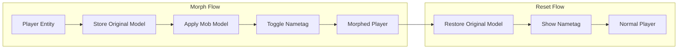
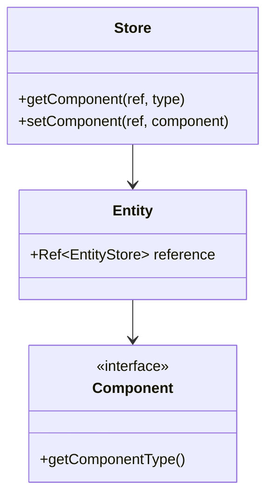

# Entity Morphing & Model-Manipulation

## Übersicht

Das Morphen von Spielern zu Mob-Modellen nutzt Hytale's Entity Component System (ECS) und das Entity Effects System.

## Design-Entscheidungen

### Morph-Verhalten

| Aspekt | Verhalten | Konfigurierbar |
|--------|-----------|----------------|
| **Skalierung** | Mob-Größe wird übernommen | Nein |
| **Hitbox/Kollision** | Ändert sich mit dem Model | Nein |
| **Animationen** | Mob-Animationen werden übernommen | Nein |
| **Sounds** | Mob-Sounds abspielen | ✅ Ja (Standard: aus) |
| **Fähigkeiten** | Mob-Fähigkeiten übernehmen (z.B. Fliegen) | ✅ Ja (Standard: aus) |
| **NPC-Erkennung** | NPCs/Mobs erkennen gemorphten Spieler | ✅ Ja (Standard: aus) |
| **PvP-Modus** | Kosmetisch vs. volle Mob-Eigenschaften | ✅ Ja (Standard: kosmetisch) |
| **Persistenz** | Morph überlebt Server-Neustart | ✅ Ja (Standard: aus) |

### UX-Verhalten

| Aspekt | Standard | Konfigurierbar |
|--------|----------|----------------|
| **Cooldown** | Kein Cooldown | ✅ Ja |
| **Duration** | Permanent (bis Reset) | ✅ Ja |
| **Morph-Effekte** | Keine visuellen/akustischen Effekte | ✅ Ja (erweiterbar) |

### Vorschau-System

**UI-basiert:**
- Mob-Vorschau wird in der UI angezeigt vor Anwendung

**Command-basiert:**
- Model wird erst nur für den Command-Ausführenden gewechselt (Vorschau)
- Muss anschließend bestätigt werden für vollständigen Morph
- `--force` Flag überspringt Vorschau und wendet direkt an

### Thread-Safety (VERIFIZIERT durch morphmod)

**WICHTIG:** ECS-Operationen müssen im World-Thread ausgeführt werden!

```java
// KORREKT: world.execute() für ECS-Operationen verwenden
player.getWorld().execute(() -> {
    Ref<EntityStore> ref = player.getReference();
    Store<EntityStore> store = ref.getStore();

    // ECS-Operationen hier sicher ausführen
    store.putComponent(ref, ModelComponent.getComponentType(), new ModelComponent(model));
});
```



## Entity Component System (ECS)

### Kernkonzepte



### Wichtige Components für Morphing

| Component | Beschreibung |
|-----------|-------------|
| `ModelComponent` | Enthält das visuelle 3D-Model |
| `NametagComponent` | Spielername über dem Kopf |
| `EffectControllerComponent` | Verwaltet aktive Effekte |
| `TransformComponent` | Position, Rotation, Scale |
| `UUIDComponent` | Eindeutige Entity-ID |

## Model-Änderung via Effect System

### EffectControllerComponent

```java
import com.hypixel.hytale.server.entity.component.EffectControllerComponent;
import com.hypixel.hytale.server.entity.effect.EntityEffect;
import com.hypixel.hytale.server.entity.effect.ActiveEntityEffect;

// Controller abrufen
EffectControllerComponent controller = store.getComponent(
    entityRef,
    EffectControllerComponent.getComponentType()
);
```

### Effect mit Model-Change anwenden

Das Effect System unterstützt `ModelChange` Konfiguration:

```json
{
  "ModelChange": "hytale:model/zombie"
}
```

Der Controller:
1. Speichert automatisch das Original-Model
2. Lädt das neue Model-Asset
3. Ersetzt das Entity-Model temporär
4. Stellt Original bei Effect-Entfernung wieder her

### Java-Code für Effect-Anwendung

```java
// Effect abrufen
EntityEffect morphEffect = EntityEffect.getAssetMap().getAsset("morphtomob:morph_zombie");

// Effect anwenden
controller.addEffect(entityRef, morphEffect, store);

// Aktiven Effect prüfen
int effectIndex = EntityEffect.getAssetMap().getIndex("morphtomob:morph_zombie");
ActiveEntityEffect activeEffect = controller.getActiveEffects().get(effectIndex);

if (activeEffect != null) {
    float remainingTime = activeEffect.getRemainingDuration();
}

// Effect entfernen
controller.removeEffect(entityRef, effectIndex, store);

// Alle Effects entfernen
controller.clearEffects(entityRef, store);
```

## Direkte Model-Manipulation

### ModelComponent

**WICHTIG:** `ModelComponent` hat KEINE `setModelAssetPath()` Methode!
Components sind quasi-immutable - man ersetzt sie komplett.

```java
import com.hypixel.hytale.server.core.modules.entity.component.ModelComponent;
import com.hypixel.hytale.server.core.asset.type.model.config.Model;
import com.hypixel.hytale.server.core.asset.type.model.config.ModelAsset;

// Model-Component abrufen
ModelComponent modelComponent = store.getComponent(
    entityRef,
    ModelComponent.getComponentType()
);

// Aktuelles Model abrufen
Model currentModel = modelComponent.getModel();
String currentModelId = currentModel.getModelAssetId();

// KORREKT: Neues Model über putComponent setzen
ModelAsset newModelAsset = ModelAsset.getAssetMap().getAsset("trork");
if (newModelAsset != null) {
    Model newModel = Model.createScaledModel(newModelAsset, 1.0f);
    store.putComponent(entityRef, ModelComponent.getComponentType(), new ModelComponent(newModel));
}
```

## Nametag-Steuerung

**Hinweis:** Die genaue API für Nametag-Steuerung ist noch zu verifizieren. Es gibt `DisplayNameComponent` in `modules.entity.component`.

```java
// DisplayNameComponent für Entity-Namen (API noch zu verifizieren)
// Mögliche Verwendung:
// DisplayNameComponent displayName = store.getComponent(entityRef, DisplayNameComponent.getComponentType());
// displayName.setVisible(false); // Methode existiert möglicherweise

// Alternative: Nametag über Effect System ausblenden
// Oder: Custom Component für Nametag-State verwenden
```

## Verfügbare Mobs/Entities auflisten

### NPCPlugin und RoleRegistry

```java
import com.hypixel.hytale.server.npc.NPCPlugin;
import com.hypixel.hytale.server.npc.role.Role;

// NPCPlugin Instanz
NPCPlugin npcPlugin = NPCPlugin.getInstance();

// Alle registrierten Rollen/Mobs abrufen
// (Konkrete API muss via WebSearch verifiziert werden)
```

### Asset-Registry durchsuchen

```java
import com.hypixel.hytale.server.asset.AssetManager;

// Model-Assets durchsuchen
// AssetManager.get().getAssets("model/*")
```

## MorphManager Implementierung

```java
package com.gorduan.hytale.playermorphtomob;

import com.hypixel.hytale.component.Ref;
import com.hypixel.hytale.component.Store;
import com.hypixel.hytale.server.core.universe.world.storage.EntityStore;
import com.hypixel.hytale.server.core.modules.entity.component.ModelComponent;
import com.hypixel.hytale.server.core.modules.entity.player.PlayerSkinComponent;
import com.hypixel.hytale.server.core.asset.type.model.config.Model;
import com.hypixel.hytale.server.core.asset.type.model.config.ModelAsset;
import com.hypixel.hytale.server.core.cosmetics.CosmeticsModule;
import com.hypixel.hytale.server.core.universe.PlayerRef;
import com.hypixel.hytale.logger.HytaleLogger;

import javax.annotation.Nonnull;
import java.util.HashMap;
import java.util.Map;
import java.util.logging.Level;

public class MorphManager {

    private static final HytaleLogger LOGGER = HytaleLogger.get("MorphManager");
    private static MorphManager instance;
    private final Map<String, MorphData> activeMorphs = new HashMap<>(); // Key: playerName

    public static MorphManager getInstance() {
        if (instance == null) {
            instance = new MorphManager();
        }
        return instance;
    }

    /**
     * Morpht einen Spieler zu einem Mob-Model.
     * WICHTIG: Model wird über putComponent gesetzt, NICHT über setModelAssetPath()!
     */
    public boolean applyMorph(@Nonnull PlayerRef playerRef, @Nonnull String modelId) {
        Ref<EntityStore> ref = playerRef.getReference();
        if (ref == null || !ref.isValid()) {
            LOGGER.at(Level.WARNING).log("Cannot morph: Invalid player reference");
            return false;
        }

        Store<EntityStore> store = ref.getStore();
        String playerName = playerRef.getUsername();

        // Model-Component abrufen
        ModelComponent currentModel = store.getComponent(ref, ModelComponent.getComponentType());
        if (currentModel == null) {
            LOGGER.at(Level.WARNING).log("Cannot morph: ModelComponent not found");
            return false;
        }

        // PlayerSkin für späteren Reset speichern
        PlayerSkinComponent skinComponent = store.getComponent(ref, PlayerSkinComponent.getComponentType());

        // Original speichern wenn nicht bereits gemorpht
        if (!activeMorphs.containsKey(playerName)) {
            MorphData morphData = new MorphData(
                currentModel.getModel().getModelAssetId(),
                skinComponent
            );
            activeMorphs.put(playerName, morphData);
        }

        // Model-Asset laden
        ModelAsset modelAsset = ModelAsset.getAssetMap().getAsset(modelId);
        if (modelAsset == null) {
            LOGGER.at(Level.WARNING).log("Cannot morph: Model asset '%s' not found", modelId);
            return false;
        }

        // VERIFIZIERT durch morphmod: Model.createUnitScaleModel() verwenden
        Model newModel = Model.createUnitScaleModel(modelAsset);
        if (newModel == null) {
            LOGGER.at(Level.WARNING).log("Cannot morph: Failed to create model");
            return false;
        }

        store.putComponent(ref, ModelComponent.getComponentType(), new ModelComponent(newModel));

        // Morph-Daten aktualisieren
        MorphData morphData = activeMorphs.get(playerName);
        morphData.setCurrentModelId(modelId);

        LOGGER.at(Level.INFO).log("Applied morph to player %s: %s", playerName, modelId);
        return true;
    }

    /**
     * Setzt einen Spieler auf sein Original-Model zurück.
     * VERIFIZIERT durch morphmod: removeComponent() + setNetworkOutdated()
     */
    public void unmorphPlayer(@Nonnull Player player) {
        Ref<EntityStore> ref = player.getReference();
        if (ref == null || !ref.isValid()) {
            return;
        }

        Store<EntityStore> store = ref.getStore();
        String playerName = player.getPlayerRef().getUsername();

        // VERIFIZIERT: ModelComponent entfernen
        if (store.getComponent(ref, ModelComponent.getComponentType()) != null) {
            store.removeComponent(ref, ModelComponent.getComponentType());
        }

        // VERIFIZIERT: PlayerSkinComponent aktualisieren für Client-Sync
        PlayerSkinComponent skinComponent = store.getComponent(ref, PlayerSkinComponent.getComponentType());
        if (skinComponent != null) {
            skinComponent.setNetworkOutdated();
            store.putComponent(ref, PlayerSkinComponent.getComponentType(), skinComponent);
        }

        activeMorphs.remove(playerName);
        player.sendMessage(Message.raw("Unmorphing..."));
    }

    public boolean isMorphed(@Nonnull String playerName) {
        return activeMorphs.containsKey(playerName);
    }

    public void forceRemove(@Nonnull String playerName) {
        activeMorphs.remove(playerName);
    }

    public void cleanup() {
        activeMorphs.clear();
    }
}
```

## MorphData Klasse

```java
package com.gorduan.hytale.playermorphtomob.data;

public class MorphData {

    private final String originalModel;
    private final boolean originalNametagVisible;
    private final String currentMobModel;
    private final boolean nametagHidden;
    private final long morphTimestamp;

    public MorphData(
            String originalModel,
            boolean originalNametagVisible,
            String currentMobModel,
            boolean nametagHidden
    ) {
        this.originalModel = originalModel;
        this.originalNametagVisible = originalNametagVisible;
        this.currentMobModel = currentMobModel;
        this.nametagHidden = nametagHidden;
        this.morphTimestamp = System.currentTimeMillis();
    }

    public String getOriginalModel() {
        return originalModel;
    }

    public boolean isOriginalNametagVisible() {
        return originalNametagVisible;
    }

    public String getCurrentMobModel() {
        return currentMobModel;
    }

    public boolean isNametagHidden() {
        return nametagHidden;
    }

    public long getMorphTimestamp() {
        return morphTimestamp;
    }
}
```

## Bekannte Mob-Models

Basierend auf Hytale-Dokumentation:

```java
public class MobModels {
    // Zone 1 - Emerald Grove
    public static final String TRORK = "hytale:model/trork";
    public static final String KWEEBEC = "hytale:model/kweebec";
    public static final String FERAN = "hytale:model/feran";

    // Zone 2 - Howling Sands
    public static final String SCARAKS = "hytale:model/scaraks";

    // Zone 3 - Borea
    public static final String FROST_WOLF = "hytale:model/frost_wolf";

    // Zone 4 - Devastated Lands
    public static final String VOID_SPAWN = "hytale:model/void_spawn";

    // Allgemein
    public static final String ZOMBIE = "hytale:model/zombie";
    public static final String SKELETON = "hytale:model/skeleton";

    // Methode zum Abrufen aller bekannten Models
    public static List<String> getAllKnownModels() {
        // Liste aller bekannten Models
        return List.of(TRORK, KWEEBEC, FERAN, /* ... */);
    }
}
```

**Wichtig:** Die genauen Model-Pfade müssen via WebSearch/WebFetch verifiziert werden!

## Referenz-Mods

### Disguise Mod (OrbisMMO_Team)

- Spieler als beliebiger NPC/Mob/Kreatur verkleiden
- Shapeshifting-Funktionalität
- https://www.curseforge.com/hytale/mods/disguise-mod

### Player Model Changer (SkyeBlueMango)

- Model-Wechsel aus Allowlist ohne OP
- https://www.curseforge.com/hytale/mods/player-model-changer

### PMA - Persistent Model Assignment

- Speichert Model-Zuweisungen persistent
- Überlebt Server-Neustarts
- https://www.curseforge.com/hytale/mods/pma-persistent-model-assignment

## Event-Handling

### Player Disconnect

```java
// Bei Disconnect Original wiederherstellen
this.getEventRegistry().registerListener(PlayerDisconnectEvent.class, event -> {
    UUID playerUUID = event.getPlayerUUID();
    if (MorphManager.getInstance().isMorphed(playerUUID)) {
        // Morph-Daten bereinigen
        MorphManager.getInstance().forceRemove(playerUUID);
    }
});
```

### Player Death

```java
// Bei Tod optional zurücksetzen
this.getEventRegistry().registerListener(PlayerDeathEvent.class, event -> {
    // Konfigurationsabhängig: Morph bei Tod zurücksetzen?
});
```

## Quellen

- [Entity Effects - Hytale Server Docs](https://hytale-docs.pages.dev/modding/systems/entity-effects/)
- [NPC & AI System - Hytale Server Docs](https://hytale-docs.pages.dev/modding/npc-ai/)
- [Mob IDs Database](https://www.hytaleitemids.com/mobs)
- [Hytale Wiki - Mobs](https://hytale.fandom.com/wiki/Mobs)
