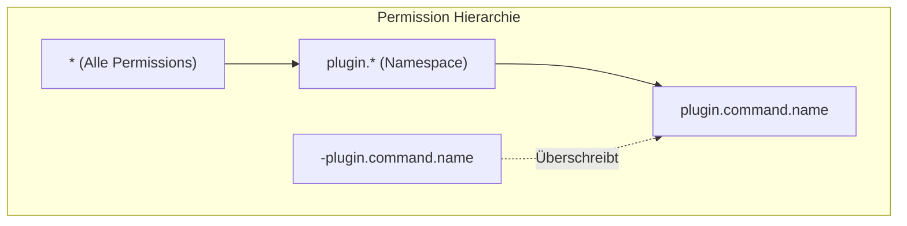

# Hytale Permission System

## Übersicht

Das Hytale Permission System bietet feingranulare Zugriffskontrolle für Server-Features, Commands und Custom-Funktionalität.



## Permission Node Struktur

Permissions folgen einem **dot-separated hierarchischen Format**:

```
# Beispiele
hytale.command.gamemode.self
playermorphtomob.morph.others
myplugin.admin.kick
```

## Matching-Patterns

### Wildcards

```java
// Alle Permissions
*

// Alle Permissions im Namespace
hytale.*
playermorphtomob.*
```

### Negation

Mit `-` Prefix explizit verweigern:

```java
// Permission verweigern
-hytale.command.kick
-playermorphtomob.morph.others
```

**Wichtig:** Negationen haben IMMER Vorrang und überschreiben geerbte Gruppen-Permissions!

## Standard-Gruppen

### OP-Gruppe

- Besitzt `*` Wildcard
- Universeller Zugriff auf alle Permissions

### Default-Gruppe

- Automatisch allen Spielern zugewiesen
- Keine speziellen Permissions
- Fallback wenn keine expliziten Gruppen

### Virtuelle Gruppen

Automatische Permissions basierend auf Spielmodus:
- Creative Mode gewährt Builder-Tools-Zugriff

## Permission-Prüfung in Plugins

### Via PermissionsModule

```java
import com.hypixel.hytale.server.core.permissions.PermissionsModule;
import com.hypixel.hytale.server.core.universe.PlayerRef;

// WICHTIG: hasPermission nimmt PlayerRef, NICHT UUID!
PlayerRef playerRef = player.getPlayerRef();
boolean hasPermission = PermissionsModule.get().hasPermission(
    playerRef,
    "playermorphtomob.morph.others"
);

// Oder statische Hilfsmethode:
boolean hasPerm = PermissionsModule.checkPermission(playerRef, "playermorphtomob.morph.others");
```

### Via CommandSender (Player)

```java
import com.hypixel.hytale.server.core.entity.entities.Player;

Player player = store.getComponent(ref, Player.getComponentType());

// Player implementiert CommandSender
if (player.hasPermission("playermorphtomob.gui")) {
    // GUI öffnen
}
```

### In Commands

```java
public class MorphCommand extends AbstractCommand {

    @Override
    @Nullable
    protected CompletableFuture<Void> execute(@Nonnull CommandContext context) {
        // Manuelle Permission-Prüfung
        if (!context.sender().hasPermission("playermorphtomob.morph.others")) {
            context.sender().sendMessage(
                Message.of("You don't have permission to morph other players!")
            );
            return CompletableFuture.completedFuture(null);
        }

        // Command-Logik...
        return CompletableFuture.completedFuture(null);
    }
}
```

### requirePermission() in Constructor

```java
public class AdminMorphCommand extends AbstractCommand {

    public AdminMorphCommand() {
        super("adminmorph", "Admin-only morph command");

        // Permission automatisch prüfen (wirft Fehler wenn nicht vorhanden)
        requirePermission("playermorphtomob.admin");
    }
}
```

## Automatische Permission-Generierung

Commands generieren automatisch Permission-Nodes:

```
{plugin.basepermission}.command.{commandname}

// Beispiel:
playermorphtomob.command.playermorphtomob
```

### Custom Permission Node

```java
@Override
protected String generatePermissionNode() {
    return "playermorphtomob.custom.node";
}
```

### Permission-Generierung deaktivieren

```java
@Override
protected boolean canGeneratePermission() {
    return false; // Öffentlicher Command
}
```

## Permission Events

### PlayerPermissionChangeEvent

```java
import com.hypixel.hytale.server.permissions.event.PlayerPermissionChangeEvent;

// Event-Listener registrieren
this.getEventRegistry().registerListener(PlayerPermissionChangeEvent.class, event -> {
    UUID playerUUID = event.getPlayerUUID();
    String permission = event.getPermission();
    boolean added = event.wasAdded();

    getLogger().info("Permission {} {} for {}",
        permission,
        added ? "granted" : "revoked",
        playerUUID
    );
});
```

### PlayerGroupEvent

```java
import com.hypixel.hytale.server.permissions.event.PlayerGroupEvent;

// Gruppen-Änderungen verfolgen
this.getEventRegistry().registerListener(PlayerGroupEvent.class, event -> {
    UUID playerUUID = event.getPlayerUUID();
    String group = event.getGroup();
    // Verarbeitung...
});
```

### GroupPermissionChangeEvent

```java
import com.hypixel.hytale.server.permissions.event.GroupPermissionChangeEvent;

// Gruppen-Permission-Änderungen
this.getEventRegistry().registerListener(GroupPermissionChangeEvent.class, event -> {
    String group = event.getGroup();
    String permission = event.getPermission();
    // Verarbeitung...
});
```

## Built-in Permission Commands

```bash
# OP Status
/op self              # Sich selbst OP geben
/op add <player>      # Spieler OP geben
/op remove <player>   # Spieler OP entfernen

# Permission Management
/perm user <player> add <permission>
/perm user <player> remove <permission>
/perm group <group> add <permission>
/perm group <group> remove <permission>
```

## PlayerMorphToMob Permissions

### Geplante Permission-Struktur

```java
public class Permissions {
    // Basis
    public static final String BASE = "playermorphtomob";

    // Alle Rechte
    public static final String ALL = BASE + ".*";

    // Command nutzen
    public static final String COMMAND = BASE + ".command";

    // GUI öffnen
    public static final String GUI = BASE + ".gui";

    // Morph-Aktionen
    public static final String MORPH_SELF = BASE + ".morph.self";
    public static final String MORPH_OTHERS = BASE + ".morph.others";

    // Nametag-Steuerung
    public static final String NAMETAG_TOGGLE = BASE + ".nametag.toggle";

    // Admin
    public static final String ADMIN = BASE + ".admin";
    public static final String RELOAD = BASE + ".reload";
}
```

### Permission-Helper-Klasse

```java
package com.gorduan.hytale.playermorphtomob;

import com.hypixel.hytale.server.core.permissions.PermissionsModule;
import com.hypixel.hytale.server.core.universe.PlayerRef;
import javax.annotation.Nonnull;

public class Permissions {

    public static final String BASE = "playermorphtomob";
    public static final String COMMAND = BASE + ".command";
    public static final String GUI = BASE + ".gui";
    public static final String MORPH_SELF = BASE + ".morph.self";
    public static final String MORPH_OTHERS = BASE + ".morph.others";
    public static final String NAMETAG_TOGGLE = BASE + ".nametag.toggle";
    public static final String ADMIN = BASE + ".admin";

    // WICHTIG: hasPermission nimmt PlayerRef, NICHT UUID!
    public static boolean hasPermission(@Nonnull PlayerRef playerRef, @Nonnull String permission) {
        return PermissionsModule.get().hasPermission(playerRef, permission);
    }

    public static boolean canMorphSelf(@Nonnull PlayerRef playerRef) {
        return hasPermission(playerRef, MORPH_SELF);
    }

    public static boolean canMorphOthers(@Nonnull PlayerRef playerRef) {
        return hasPermission(playerRef, MORPH_OTHERS);
    }

    public static boolean canToggleNametag(@Nonnull PlayerRef playerRef) {
        return hasPermission(playerRef, NAMETAG_TOGGLE);
    }

    public static boolean canUseGUI(@Nonnull PlayerRef playerRef) {
        return hasPermission(playerRef, GUI);
    }

    public static boolean isAdmin(@Nonnull PlayerRef playerRef) {
        return hasPermission(playerRef, ADMIN);
    }
}
```

## Konfigurationsdatei

Permissions werden in `permissions.json` gespeichert:

```json
{
  "groups": {
    "default": {
      "permissions": []
    },
    "moderator": {
      "permissions": [
        "playermorphtomob.command",
        "playermorphtomob.gui",
        "playermorphtomob.morph.self"
      ]
    },
    "admin": {
      "permissions": [
        "playermorphtomob.*"
      ]
    }
  },
  "users": {
    "uuid-hier": {
      "groups": ["admin"],
      "permissions": []
    }
  }
}
```

## Best Practices

1. **Hierarchische Struktur verwenden**
   ```
   plugin.feature.action
   playermorphtomob.morph.self
   playermorphtomob.morph.others
   ```

2. **Wildcards für Admins**
   ```
   playermorphtomob.*
   ```

3. **Separate Permissions für Self/Others**
   ```
   .morph.self
   .morph.others
   ```

4. **Negationen sparsam einsetzen**
   - Nur wenn unbedingt nötig
   - Überschreiben geerbte Permissions

5. **Default-Permissions dokumentieren**
   - Welche Permissions brauchen normale Spieler?
   - Welche sind Admin-only?

## PermissionsPlus (Optional)

GUI-basiertes Permission-Management:

- **In-Game GUI:** `/permsplus` öffnet UI
- **Auto-Discovery:** Findet Permissions aller Plugins
- **CurseForge:** https://www.curseforge.com/hytale/mods/permissionsplus

## Quellen

- [Permissions and Access Control - Hytale Server Docs](https://hytale-docs.pages.dev/modding/plugins/permissions/)
- [Server Commands & Permissions - Britakee Docs](https://britakee-studios.gitbook.io/hytale-modding-documentation/server-administration/22-server-commands-permissions)
- [PermissionsPlus Mod](https://www.curseforge.com/hytale/mods/permissionsplus)
